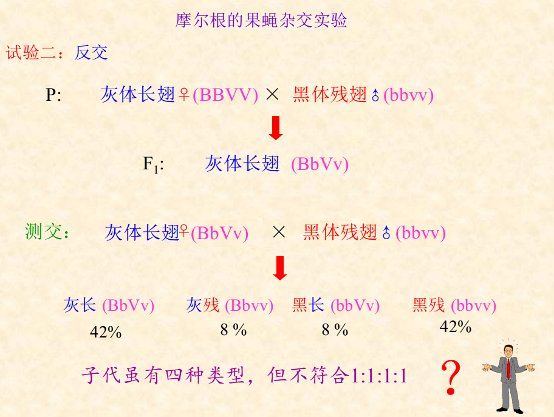

## 重点回顾
- 性别决定
	- 性指数：X染色体与常染色体组数东西额比例

- Lyonjia假说
	- 随机
	- 不可逆
	- 早期失活

- 初级例外，次级例外。

XaXa X XaY
XAXA X XAY

##连锁交换（交叉互换）
### 连锁现象
- 互引相　　　双隐双显多
- 互斥相	两个形状一隐一显多

- 摩尔根实验

两个F1代性别不同
- 连锁
	- 完全连锁（纯合子）雄性果蝇，雌性家蚕
	- 不完全连锁（杂合子，交叉互换，有一定概率。）
	- 本质：同源染色体非姐妹染色单体发生交叉互换
	- 两个基因发生的交换的频率，与两个基因的距离有关
	- 受染色体长度限制
- 自由组合：非同源染色体自由重组
	- 与染色体对数限制

### 率
- 交换值（cross-over value）（%）=（发生交换的配子数/总配子数）×100
- 重组率(Recombination Frequency，RF): 测交子代中重组型个体数占总个体数的百分率
- C 约= RF  (RF 不会大于50%
- 多线多交换——亲本型与重组型配子之比仍为1 : 1。

### 基因定位与染色体作图

## 四分子遗传分析

- 四分子(tetrad):某些真菌减数分裂的四个产物留在一起，称为四分子;
- 顺序四分子(ordered tetrad): 某些真菌减数分裂的四个产物不仅留在一起，而且按照一定的顺序以直线排列在子囊中;

- 单基因
	- 计算重组率，图距
- 两个连锁基因
	- PD亲二型，NPD非亲二型，T四型
	- 同臂，异臂，子囊型数量不同

### 非顺序
