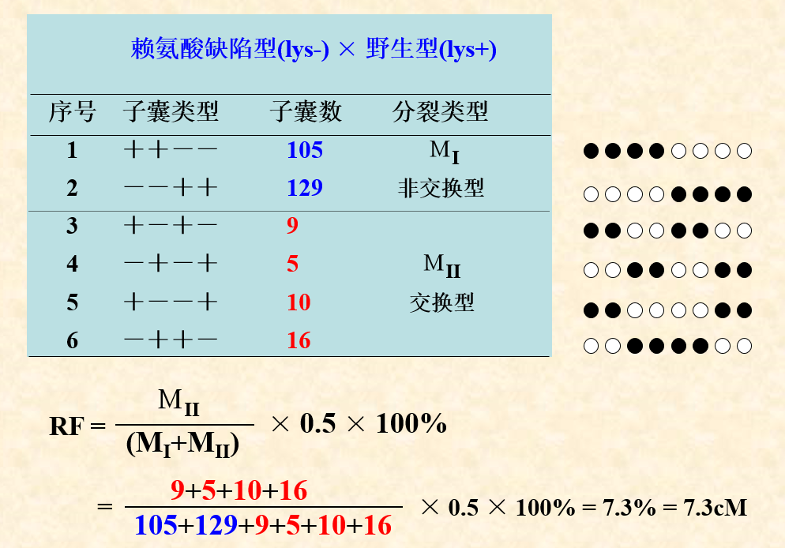
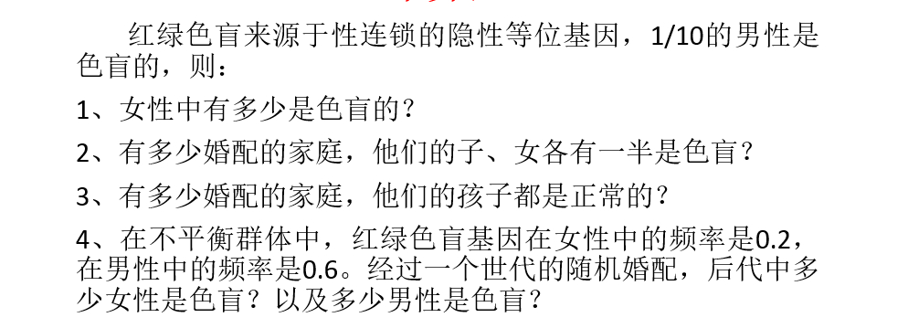

# 遗传学

张凤伟老师。大一上过他带的全校任选生科导论。。讲课一般。但是要求严格。抓迟到什么的，迟到了可能会被他骂。

部分知识点在分子生物学中也会学的个说。

上课提问，没到要扣不少分。要答对一些题，才能拿满平时分。。偶尔可以复习一下，准备刷平时分。

遗传学实验不好做。容易GG。报告写好一点就行。

果蝇养不成，貌似也没太大关系，老师最后会给一些数据的。

## 期中

考的全是ppt里的例题。。没考概念。

## 期末

名词解释15选10.填空30选20.简答5选3.计算4选2，1个必做.

范围较大有的选，不作死不会死。

简答原题：

1. 简述中断杂交作图原理，并说明在利用不同Hfr品系作图时，原点和基因顺序不同的原因？
2. Holliday模型过程
3. 数量性状多基因假说
4. 免疫球蛋白轻重链的基因片段组成。与基因重排。
5. 染色体结构变异的种类和遗传学效应

计算题：（后面四道选两道）

1. 近交系数，通路计算（必做题）
2. 遗传病计算。（高中题）
3. 像这样的。
4. 
5. 细菌的转化作图计算啥的。。

