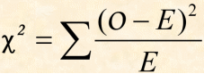
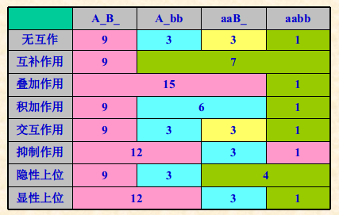
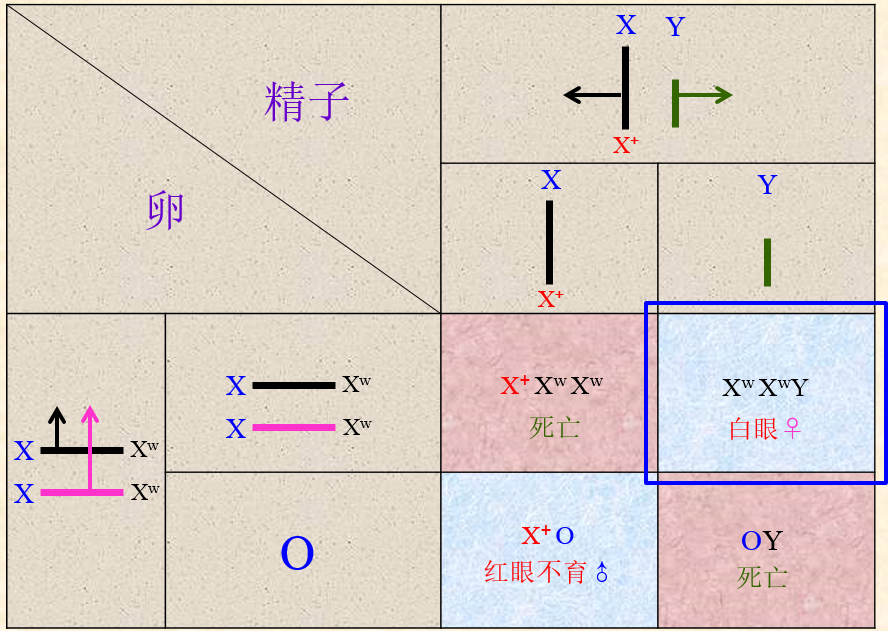
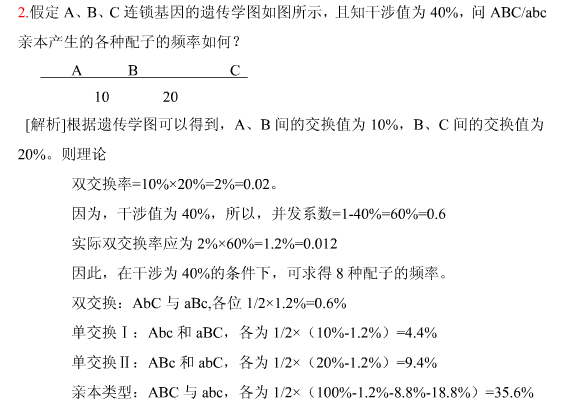
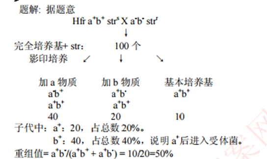

# 遗传学期中笔记
[TOC]
## 说明
考试内容：考到免疫遗传学，每章出一道大题，主要考计算和原理。应该不怎么考概念(名词解释)..
妈的，平时一点笔记没有，上课也没听。。提前5,6开始复习。祝好。。

## 绪论
不知道考不考。。先跳过。

## 孟德尔遗传
基本概念：...
### 自由组合
x对——$F_1$AaBb... 共$2^x$个配子——$F_2$基因型有$3^x$种——基因型分离比$(1:2:1)^x$——表现型分离比$(3:1)^x$

#### 孟德尔成功原因
1. 选材得当（豌豆自花闭花授粉，形状稳定，易于操作控制，种子在豆荚内不会丢失，选择的形状不连锁
2. 实验设计严密（正反交，大样本，持续自交?
3. 定量分析
4. 缜密推理（区分显隐性
5. 精确验证（测交，回交

#### 卡方检验
假设：$H_0$为实际值与理论不同分布

卡方值=实际值-理论值.....自由度df=N-1（N为类型数
$\alpha$=0.05，查表，P值。
若求出的卡方值小于P值，则表示，在xxx的显著水平上，差异不显著，拒绝$H_0$。误差属于随机误差。
则证明自由组合

遗传病计算：不拘小节...没有说明的就是纯和显性的。

### 互作
- 基因与环境的互作：环境，后天因素(例如：水稻和温度，兔子脂肪颜色与黄色素)
- 基因互作：不同基因间相互作用、影响性状表现的现象

#### 等位基因间的互作
- 完全显性：F1表型与亲本之一相同
- 不完全显性：F1表型为双亲形状的中间型
- 共显性：F1在同一部位同时表现双亲性状
- 镶嵌显性：F1在不同部位表现双亲形状
- 纯合致死：两个等位基因纯合时导致个体死亡
    - （隐性recessive/显性dominant）致死基因：能使个体不能存活的等位基因

#### 非等位基因的互作

- 互补作用（Complementary effect）
    - 两类显性基因只有同时存在时，才表现某一性状，否则表现为另一性状，F2表型分离比为9:7

- 叠加作用（Duplicate effect）
    - 两对等位基因独立地决定同一性状，只要有一类显性基因存在，该性状就能表现，F2表型分离比为15 : 1

- 积加作用（Additive effect）
    - 两类显性基因都存在时产生第一种性状，仅一类显性基因存在时产生第二种性状，两类显性基因都不存在时产生第三种性状，F2表型分离比为9 : 6 : 1

- 交互互作（interaction）
    - 不同等位基因相互作用决定不同的表型，F2表型分离比为9 : 3 : 3 : 1

- 抑制作用（Inhibiting effect）
    - 在两对基因中，其中一对的显性基因，本身并不控制其他性状的表现，但对另一对基因的表现具有抑制作用，该基因称显性抑制基因， F2表型分离比为13 : 3
- 上位作用（Epistatic effect）
    - 两对等位基因共同对一对性状发生作用，其中一对等位基因对另一对等位基因的表现有掩盖作用
    - 掩盖者为上位基因(epistatic gene)，被掩盖者为下位基因(hypostatic gene)
    - 隐性上位(Recessive epistasis)
        - A控制黑色素形成，B决定黑色素在毛皮中的分布，在aa个体中，没有黑色素形成，也就谈不上色素的分布，B的作用被掩盖，因此a是B的隐性上位基因。9 : 3 : 4
    - 显性上位(Dominant epistasis)
        - B控制黑色，Y控制黄色，只要存在B，Y的作用就被掩盖，只有当B不存在，而Y存在时，才会出现黄颖， B是Y的显性上位基因。 12 : 3 : 1
          
          <!---->

## 连锁遗传
### 性别决定
性染色体发现历程
性染色体决定性别的类型：XY型，ZW型，XO型
性基因平衡理论：果蝇的性别取决于性指数，即X 染色体数与常染色体组数的比例(X/A)
性染色体剂量补偿效应。Lyon假说。巴氏小体。
其他决定方式：染色体倍数，环境

### 伴性遗传
#### 摩尔根实验
1. 白眼雄蝇X红眼雌蝇
2. 白眼雄蝇X红眼杂合雌蝇
3. 白眼雌X红眼雄

#### 初级例外，次级例外

- 初级例外：白眼雌X红眼雄，出现了很少的**不育的红眼雄**和**白眼雌**的后代
- 次级例外：上述F1**白眼雌**X红眼雄，出现了稍多的**红眼雄**和**白眼雌**的后代
- 例外时，减数分裂生成配子错误，白眼雌为XXY，不育红眼雄为X
- XXY生成配子。。。。导致次级例外
- 结合显微镜观测，确定白眼基因在X染色体上

### 连锁交换
发现有些两对性状不符合自由组合。
连锁：处于同一条染色体上的基因较多地联系在一起遗传的现象称为连锁
连锁交换本质：同源染色体的非姐妹染色单体间发生局部交换

交换值C，重组率RF<=50%
交换率代表距离，用重组率估计交换率作图
两点测交，三点测交

#### 三点测交

1. 找出最少的一类，为双交换。确定基因排列顺序
2. 针对两两基因的亲本型，重组型计算重组率
3. 作图。（加2倍双交换值

#### 相关计算

大图距：$RF = 0.5(1 - e^{-2c})$ .c为图距

干涉I=1-C，并发系数C=$$\frac{实际双交换率}{两交换位点交换率乘积} $$

### 四分子遗传分析

#### 顺序四分子遗传分析

第一次分裂分离，第二次分裂分离

重组率 = $$\frac{第二次分离数}{总数} * 0.5 *100\%$$

连锁的基因

计算重组率
单个基因单独计算，基因之间的重组率=$$\frac{NPD+0.5T}{总数}$$

#### 非顺序四分子

放弃...

## 细菌遗传分析

### 细菌

E.coli
结构特点：
优点：世代周期短，个体小——便于管理和生化分析，裸露DNA、单倍体——基因突变研究，影印培养——便于研究基因功能，转化、转导和接合——重组

#### 影印法

人工诱变放置完全培养基培养

然后转到，普通培养基和添加XXX的培养基

比对，能够挑出突变型

### 接合

#### 基本概念

原核生物的遗传物质通过细胞的**直接接触**从供体(donor)转移到受体(receptor)内的过程

F因子：染色体外遗传物质，环状DNA

有F因子的，为$F^+$，没有F因子的为$F^-$，F因子整合到宿主染色体里的为Hfr(高频重组品系)，重组频率10^4倍以上

F+供体与Hfr供体的同异。。

#### 中断杂交

遗传物质是直线转移，单位min，like so

1. Hfr X F- 培养
2. 不同时间取样，搅拌器中断，杀死Hfr，检查基因转移情况

间距短的基因要用重组作图

 

#### F'因子，性导

F 因子偶尔在环出时不够准确，会携带出染色体上的一些基因，这种因子称为**F'因子**。

性导：指接合时由F'因子所携带的外源DNA整合到细菌染色体的过程

作用：

### 转化
#### 概念

某些细菌通过其**细胞膜摄取**周围供体（染色体片段），将此外源DNA片段通过**重组**整合到自己染色体的过程。

供体：是DNA、染色体，不是生命

#### 转化过程
1. 受体细胞处于感受态
2. 供体DNA与受体细胞结合
3. DNA摄取
4. 联会
5. 整合（重组）

作图...

### 转导

指以噬菌体为媒介进行的细菌遗传物质重组

不需要直接接触，不受DNA酶影响

过程：。。

普遍性转导频率低

三因子转导判断计算次序，共转导频率，距离

流产转导：受体只有部分重组了供体DNA，没有重组的部分利用母体的相关酶能活几代，只能形成小菌落

局限性转导：只能转移细菌染色体特定部分基因的转导

## 病毒遗传分析

### 噬菌体

结构简单，多样性

优点：
> 1. 世代周期短,子代群体大
> 2. 遗传物质比较简单
> 3. 单倍体，便于研究基因突变
> 4. 突变体多

烈性：入侵，裂解宿主

温和：溶源性，整合或不整合到染色体上，随着复制而复制

突变型

### 重组测验

计算...基因顺序，交换啥的。

参考之前的例题与这道例题..

Benzer的重组测验：混合感染

### 互补测验

顺反测验：指将两个突变分别处于顺式和反式，根据其表型确定两个突变是否是同一基因的试验

## 同源重组

同源重组：依赖大范围的DNA同源序列的联会，重组过程中，两个染色体或DNA分子交换对等的部分。

>  例：同源染色体非姐妹单体交换；
> ​        细菌的转化、转导、接合；
> ​        噬菌体的重组…

断裂和重接模型：过于简单，不能解释xxx

模板选择复制模型：违背半保留

### Holliday模型

过程

基因转变：一个基因转变为它的等位基因的遗传学现象

> 实质：重组过程中留下的局部异源双链区，在细胞内的修复系统识别下不同的修复产生的结果

### MR模型

解释不对称重组

修复校正：若一个杂种分子被校正为野生型(突变型)，另一个未被校正

极化子：距离单链断裂点的位置越近越容易发生基因转变，越远越不易发生转变，由此基因转变频率由高到低形成一个梯度，染色体上呈现基因转变极化现象的区域称为极化子