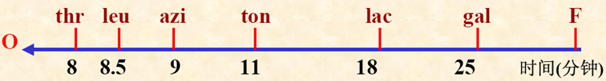
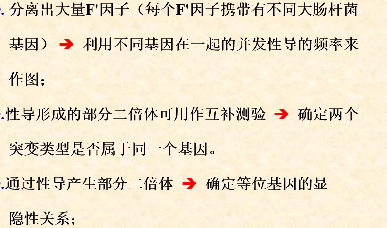

## 细菌遗传分析

### 细菌

E.coli
结构特点：
优点：世代周期短，个体小——便于管理和生化分析，裸露DNA、单倍体——基因突变研究，影印培养——便于研究基因功能，转化、转导和接合——重组

#### 影印法

人工诱变放置完全培养基培养

然后转到，普通培养基和添加XXX的培养基

比对，能够挑出突变型

### 接合

#### 基本概念

原核生物的遗传物质通过细胞的**直接接触**从供体(donor)转移到受体(receptor)内的过程

F因子：染色体外遗传物质，环状DNA

有F因子的，为$F^+$，没有F因子的为$F^-$，F因子整合到宿主染色体里的为Hfr(高频重组品系)，重组频率10^4倍以上

F+供体与Hfr供体的同异。。

#### 中断杂交

遗传物质是直线转移，单位min，like so

1. Hfr X F- 培养
2. 不同时间取样，搅拌器中断，杀死Hfr，检查基因转移情况

间距短的基因要用重组作图

 

#### F'因子，性导

F 因子偶尔在环出时不够准确，会携带出染色体上的一些基因，这种因子称为**F'因子**。

性导：指接合时由F'因子所携带的外源DNA整合到细菌染色体的过程

作用：

### 转化
#### 概念

某些细菌通过其**细胞膜摄取**周围供体（染色体片段），将此外源DNA片段通过**重组**整合到自己染色体的过程。

供体：是DNA、染色体，不是生命

#### 转化过程
1. 受体细胞处于感受态
2. 供体DNA与受体细胞结合
3. DNA摄取
4. 联会
5. 整合（重组）

作图...

### 转导

指以噬菌体为媒介进行的细菌遗传物质重组

不需要直接接触，不受DNA酶影响

过程：。。

普遍性转导频率低

三因子转导判断计算次序，共转导频率，距离

流产转导：受体只有部分重组了供体DNA，没有重组的部分利用母体的相关酶能活几代，只能形成小菌落

局限性转导：只能转移细菌染色体特定部分基因的转导