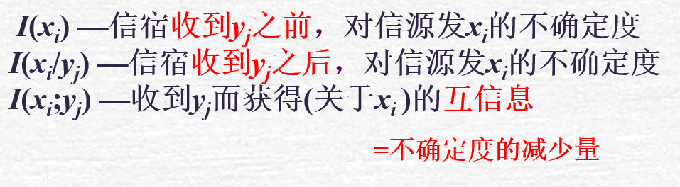
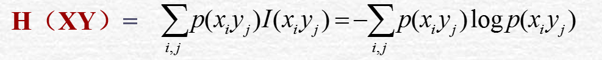

# 决策树

## 基本概念

自信息量：在收到xi之前，收信者对信源发出xi的不确定性，$I(X_i)=-log_2p(x_i)$

与事件发生概率有关，用对数可加，非负，小概率事件带来的信息量大

信息熵：$H(X)=\Sigma_i p(x_i)I(x_i)$或Entropy(X)，度量整个信源X的不确定性。

> 在决策树中，不同的事件可以理解为标签
>
> 单位是比特/符号或比特/符号序列

*************

#### 联合熵

> 联合熵是联合符号集合 XY上的每个元素对x,y的自信息量的概率加权统计平均值

#### 条件熵

A特征有n个取值
$$
H(D|A) = \sum_{i=1}^{n}\frac{|D_i|}{|D|}H(D_i)---(3)
$$

> 在XY联合集上，条件自信息的数学期望

## ID3

用信息增益Gain作为衡量标准

> Gain：使用某属性分割样本导致的期望熵降低

叶节点条件：分类一致（信息熵为0）、没有其他属性了选分类最大的一项、

## 在内含子识别中的应用

数据：10bp的序列，5,6两位为GT的正反例

特征：

1. 第x位为X。（8维
2. 第x为是否为ATCG，（4*8维