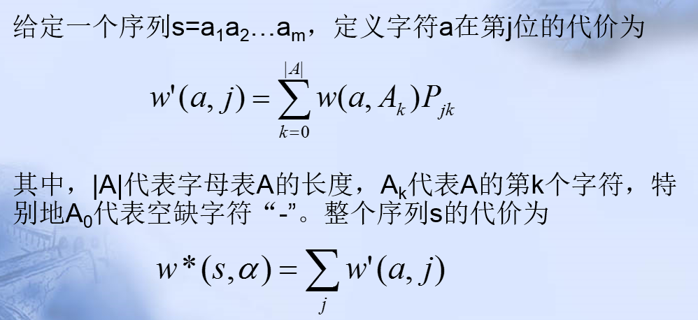

http://www.lmbe.seu.edu.cn/chenyuan/xsun/bioinfomatics/Web/CharpterThree/3.3.htm

## 意义

同时比对一组序列对于研究分子结构、功能及进化关系更为有用。例如，某些在生物学上有重要意义的相似性只能通过将多个序列对比排列起来才能识别。同样，只有在多序列比对之后，才能发现与结构域或功能相关的保守序列片段。对于一系列同源蛋白质，人们希望研究隐含在蛋白质序列中的系统发育的关系，以便更好地理解这些蛋白质的进化。在实际研究中，生物学家并不是仅仅分析单个蛋白质，而是更着重于研究蛋白质之间的关系，研究一个家族中的相关蛋白质，研究相关蛋白质序列中的保守区域，进而分析蛋白质的结构和功能。序列两两比对往往不能满足这样的需要，难以发现多个序列的共性，必须同时比对多条同源序列。

##ＳＰ模型

评价多重序列比对的结果

## 动态规划及优化

多维情况下，复杂度高$2^{n-1}$ n为序列数目。

用剪枝来优化。略。。

## 星形比对

核心序列和其他序列做两两比对

不够加空位，聚集？的顺序？

任意两序列做两两比对，得分最低高的，一条序列做核心序列

## 树形比对

忘记了。。。

## 其他

ClustalW：

（1）先将多个序列进行两两比对，基于这些比较，计算得到一个距离矩阵，该矩阵反映每对序列的关系；

（2） 利用距离矩阵，建立一棵“相关树”；

（3）从最接近的一对序列出发，逐步归并形成比对的聚类，直到所有序列处理完。

特征统计图谱：

将得到的多重序列比对结果。做统计图谱

给定一条的序列，利用统计图谱计算代价，如果代价值小，说明具有该特征。

******

不考

w的定义？？

