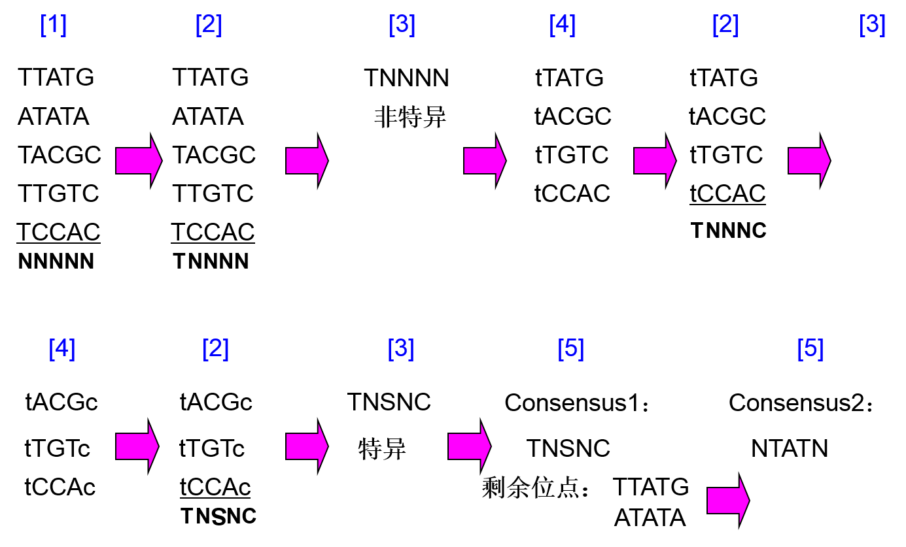
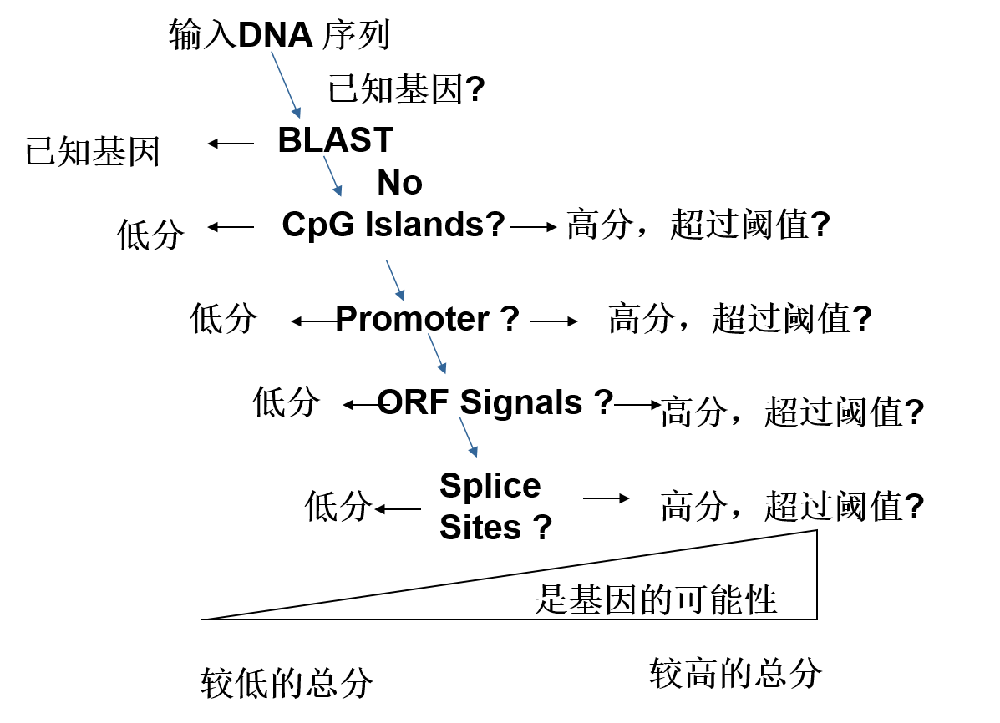

[TOC]

# 绪论

信息特性：不灭性，

两种信息载体：核酸，蛋白

三种信息：遗传～，功能～，进化～

数据：序列～，结构数据，功能数据

# 数据库&算法

## 数据库

- 一级库（直接来源于实验获得的原始数据，只经过简单的归类、整理和注释。

  - 核酸序列库
    - GenBank（NCBI 美国国家生物技术信息中心
    - EMBL（欧洲分子生物学实验室
    - DDBJ（Databank of Japan 日本国家遗传学研究所

  - 蛋白质序列库（**特点？**
    - PIR（protein information resource 全面的、经过注释的、非冗余的蛋白质序列数据库
    - SWISS-PORT（注释详细，最小冗余，与其他数据库连接

    注释包括：参考文献，分类信息，来源，功能位点，蛋白特征（SP---功能描述，结构，其他蛋白相似性，疾病，序列的矛盾、变化

  - 蛋白质结构库
    - PDB（protein data bank

    原子坐标、物种来源、测定方法、提交者信息、一级结构、二级结构

- 二级库的含义：生命科学不同研究领域的实际需要，对基因组图谱、核酸和蛋白质序列、蛋白质结构以及文献等数据进行分析、整理、归纳、注释，构建具有特殊生物学意义和专门用途的数据库

核酸序列文件：

| EMBL标识字 | GenBank标识字    | 含义                                    |
| ------- | ------------- | ------------------------------------- |
| ID      | LOCUS         | 序列名称                                  |
| DE      | DEFINITION    | 序列简单说明                                |
| AC      | ACCESSION     | 唯一的序列编号                               |
| SV      | VERSION       | 序列版本号                                 |
| KW      | KEYWORDS      | 与序列相关的关键词                             |
| OS      | SOURCE        | 序列来源的物种名                              |
| OC      | ORGANISM      | 序列来源的物种学名和分类学位置                       |
| DT      |               | 建立日期                                  |
| RN      | REFERENCE     | 相关文献编号或提交注册信息                         |
| RA      | AUTHORS       | 相关文献作者或提交序列作者                         |
| RT      | TITLE         | 相关文献题目                                |
| RL      | JOURNAL       | 相关文献刊物名或作者单位                          |
| RX      | MEDLINE       | 相关文献Medline引文代码                       |
| RC      | REMARK        | 相关文献注释                                |
| RP      |               | 相关文献其它注释                              |
| CC      | COMMENT       | 关于序列的注释信息                             |
| DR      |               | 相关数据库交叉引用号                            |
| FH      | FEATURES      | 序列特征表起始 http://www.ebi.ac.uk/fasta33/ |
| FT      |               | 序列特征表子项                               |
| SQ      | BASE  CONTENT | 序列长度、碱基数目统计数                          |
| 空格      | ORIGIN        | 序列                                    |
| //      | //            | 序列结束标志、空行                             |

蛋白略。

FASTA数据：第一行是由大于符号（＞）打头的任意文字说明，主要为标记序列用，第二行为序列

## FastA算法

具体~

对蛋白序列更敏感，可能会错失一些非最佳有意义的比对

比对算法：Blast,Fasta。两个评价E-value，

## BLAST

改善FastA的算法的性能，通过寻找更好的热点，提高计算速度 

局部比对中不包括空缺字符

思想：~

Score：利用打分矩阵对匹配片段进行打分，相似度越高，值越大

E-Value：在同样长度情况下，两个氨基酸残基随机排的序列进行打分，得到上述score值概率的大小

## 其他

VAST：搜索蛋白质三维结构相似的

SRS：开放的数据库查询系统，高效，可安装。。

Entrez：数据库检索系统，“数据库的数据库”

# 序列比对

通过比对发现生物的功能结构和进化（同源性

同源性（homology，指两个序列具有共同的祖先

	直向同源：来自不同的种属的同源序列
	共生同源：来自同一种属的序列，一般由进化过程中的序列复制产生

海明距离：等长序列中，不同的位点数（简单方便，不够精确

编辑距离：把给定两个字符串中的一个转化为另一个所需要的编辑操作的最小操作数

> 初始条件：$S[0][i]=i，S[j][0]=j$
>
> 状态转移方程：
> $$
> S[i][j] = min(S[i-1][j]+1, S[i][j-1] + 1, S[i-1][j-1]+x) （如果s[i]=t[j] 则 x=0
> $$
>

点阵图：可用于处理颠倒，gaps，重复

非重叠平行斜线的最长组合

缺点慢，序列长了不易观察结果

采用滑动窗口技术，参数：窗长，阈值

降低噪声，跟明确指出显著相似性区域

打分矩阵：详细地列出各种字符替换的得分，从而使得计算序列之间的相似度更为合理

核酸：

- 等价矩阵匹配1分，错配0分
- blast矩阵匹配5分，错配-4
- 转移矩阵，同类转换-1，不同类颠换-5，匹配1

蛋白：

- 等价：匹配1分，错配0分
- GCM遗传密码子矩阵：用于进化距离的计算，计算结果可以直接用于绘制进化树

> 导致密码子改变所需改变核苷酸的数量来定义两个氨基酸之间的距离

- 蛋白质疏水矩阵：替换前后疏水性变换不大，得分高

- PAM矩阵：蛋白质序列的全局比对结果

  发现替换不是随机的。研究一些蛋白质家族突变中发现的。容易发生的突变，不会对功能结构产生太大的影响。

  这些突变称为被接受的点突变

  PAM进化距离：比对序列中每一百个氨基酸中有多少是被接受的点突变

  相似度越低的用的PAM矩阵越高。PAM250最经常使用

  为了得到更好的结果，可以多用几个矩阵来比对

- BLOSUM

  从蛋白序列块比对堆导出来的。低阶用于比对亲缘远的，基于保守位置，星型比对模型。

## 两两对对

动归：最优子结构（最优解包括子问题的最优解）

NW算法——全局比对

### SW

长对长：都初始化为0

长对短：局部比对。长序列初始化为0。最后一行特殊处理。

## 多重比对

http://www.lmbe.seu.edu.cn/chenyuan/xsun/bioinfomatics/Web/CharpterThree/3.3.htm

隔壁

## 片段组装

鸟枪测序法(shotgun sequencing)

将大分子DNA随机敲碎成小片段，对小片段进行测序，根据重叠区计算整合出完整序列

成本低，快速，易于自动化，重复测序效率低

两种策略：分级～，全基因～

片段组装问题定义：寻找最短的字符串s，使得F字符串集中的字符串均为其连续子串

局部比对，多重比对，覆盖：一个片段的末端与另一个片段的前端相同（或相似）的部分

**4个主要问题**：碱基标示错误，片段方向，重复片段，缺少覆盖

三个步骤

（1）首先进行序列片段的两两比较，确定可能的片段之间的覆盖

（2）确定所有片段统一的覆盖模式（模型），即确定各个序列片段的相对位置

（3）最后确定片段组装结果，即确定目标序列

三种模型

1. 最短公共超串模型：目标序列必须是片段的超串。所以，不允许误差，须已知方向。

2. 重建模型：解决误差，方向问题。编辑距离。

   给定一个字符串集合F，求一个最短的字符串S，使得对于所有属于F的字符串f，

   下式成立： min (ds(f, S), ds(f’, S) )

3. 多重连续区～：解决了四个问题。？

   t值越小，可能的结果就越多，而组装结果的可靠性就越低。t值也不能太大，否则会产生多个不连续区域

# 基因组信息分析与基因识别

DNA序列分析：寻找基因、基因表达及调控关系

基因识别基本概念？

原核真核基因组特点（不考）

基因注释，DNA序列分析过程（F

（1）发现重复元素。这是重要的一步，因为重复元素会给DNA序列分析带来许多问题。例如，由于重复元素的存在，在**搜索数据库时可能得到许多同样的结果，这些结果的得分很高，使解释数据库搜索结果变得复杂、困难**。所以，一般先寻找并**屏蔽重复的和低复杂性的序列**，然后寻找基因以及与其相关的调控区域。

（2）数据库搜索。通过数据库搜索，**发现相似序列或者同源序列**，根据相似序列具有相似结构及相似功能的原理，通过类比，得到关于待分析序列的初步信息，指导进一步的详细序列分析。例如，如果通过搜索发现待分析的序列与EST或已知的蛋白质编码序列相似，则可以推测待分析的序列是基因序列。

（3）分析功能位点。其主要目的是**识别DNA序列上存在的序列信号**，具体地说，就是特殊的片段。这些片段与基因及调控信息有关，如转录剪切位点、启动子、起始密码子等。对于基因识别问题来说，信号识别有助于确定基因所在的区域。

（4）序列组成统计分析。蛋白质编码区域与非编码区域在DNA序列组成上具有明显不同的统计特征，编码序列具有三联周期性，编码区域多联核苷酸出现频率与非编码区域不同。因而，可以通过统计分析预测基因的编码区域，预测一段DNA序列成为编码区域的可能性，寻找可能的基因外显子。

（5）综合分析。综合数据库搜索、功能位点分析、序列组成分析等的阶段性结果，检查这些结果的相容性，经过整理，最终得到一致性的分析结果。

敏感性，特异性，综合指标：AC，CC

## 功能位点分析

1. 利用共有序列搜索功能位点

   1. 构造共有序列

      

   2. 搜索（数据库，给定序列）

      缺点：无概率描述

2. 感知矩阵，概率矩阵。训练出来的矩阵，用于识别功能/非～位点 ？

**核苷酸关联分析**：http://www.lmbe.seu.edu.cn/chenyuan/xsun/bioinfomatics/Web/CharpterFive/5.4.htm  为了什么？

单个核苷酸，二联核苷酸，距离k的核苷酸相关性

//识别DNA中蛋白序列两类方法：基于特征信号识别，基于统计分析

## 基因识别/预测

基因预测方法：最长ORF，同源性比对，其他。第14章ppt http://www.lmbe.seu.edu.cn/chenyuan/xsun/bioinfomatics/Web/CharpterFive/5.5.htm

1. 最长ORFs：原核基因大部分是编码基因。所以可以酱紫。尽量不要出现终止密码子，找到最长的序列。

2. 基于序列相似性（同源）：与已有数据进行比对，具有生物学意义。缺点：数据有限，数据错误，相似的定义。

   可能的流程

3. 基于DP的方法：

   定义 gt，ag为内含子外显子交界。标识内含子外显子。作图，获得基因序列。然后。。。

   需满足3个条件：所有外显子加起来是3的倍数。内部没有终止子。起始密码子，终止密码子。

   筛选：利用DP寻找代价最小的路径。（代价的衡量略）

存在的问题：基因的定义不明确；只能识别编码蛋白基因；检测单个基因；同源保守不能发现新基因；忽略了基因结构信息

# 决策树

各种信息定义。

# 系统发生分析

## 绪论

系统发生：指生物形成或进化的历史

系统发生学(遗传分类学)：研究物种之间的进化关系，通过研究生物大分子(序列)

系统发生分析：推断或评估进化关系，目标结果是系统发生树

系统发生树：通过系统发生分析推断出的进化关系用树来表示。是对一组实际对象的世代关系的描述，包括了分子进化，物种进化。

## 基于距离的构建

https://en.wikipedia.org/wiki/UPGMA ok

https://en.wikipedia.org/wiki/Neighbor_joining

Fitch-Margoliash,NJ重点

FM,NJ重点。ME是啥子。

# HMM

## 基本概念

随机过程：给定时间，事物变化具有随机性。

时间，随机变量(事物)~连续/离散

markov过程：对给定的时间,事物从一种状态转移到另一种状态时，过程仅取决于前面 n 种状态

## 估计问题

给定观测序列，模型参数，求发生的概率

## 解码问题

给定观测序列，模型参数，求最优的状态序列

## 学习问题

通过观测序列，求模型参数。略。。

## 生物序列的markov过程

1. 判别是否属于CpG岛

   利用正例反例，构建正反概率矩阵

   综合两个矩阵：log(a^+^/a^-^)

   给定DNA片段，利用综合矩阵计算，（归一化1/n

   根据所得值，可以判断~

   缺点：对长序列识别，采用滑动窗口。不知道CpG长度，复杂度高。。

2. 利用HMM来识别

   观测值：$A,T,C,G$；状态：$A^+,T^+,C^+,G^+,A^-,T^-,C^-,G^-$

   输出概率：$A^+,A^-$均输出$A$

   状态转移：正反内部状态可训练出来，正反转移的概率取该列平均。q,p为正反例比例。

# 基因表达信息分析

稍略。

药物设计（不考