# 生物统计学note

*Outline*

[TOC]

## 绪论

### 基本概念

- 总体：研究的全部对象
- 个体：组成总体的每一个基本单元
- 样本：总体的一部分，从总体中随机抽取的部分个体
- 样本含量：样本中包含的个体数目
- 同质(homogeneity): 同类个体共有特性，指观察单位或者研究个体间被研究指标的主要影响因素相同或者基本相同。
- 变异(variation)：同类个体间的差异，由于生物个体的各种指标所受影响因素极为复杂，同质的个体间各种指标存在差异
- 试验(trial)：是对事物或社会对象的一种检测性的操作，用来检测那里正常操作或临界操作的运行过程、运行状况等。
- 实验(experiment)：对抽象的知识理论所做的现实操作，用来证明它正确或者推导出新的结论。它是相对于知识理论的实际操作
- 基本事件：试验/实验的每一最基本的结果
- 事件：基本事件的集合
- 频率：样本的实际发生率，大量观察，获得A时间发生的频率，可以用来估计概率
- 精确度，准确度。
- 误差试验中不可控因素引起的观测值得差异值，错误指试验过程中人为的作用引起的误差

##数据描述

### 图表

1. ​

### 集中趋势度量

- 算术平均数
- 几何平均数
- 中位数
- 众数

### 离散趋势度量

- 极差，四分位数差距

- 方差，标准差

  - 离均差 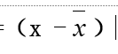

  - 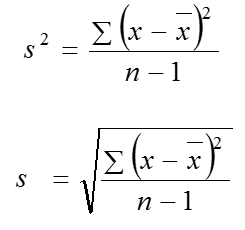
- 自由度df/v = n-1/n
- 变异系数：不同样本之间比较变异程度，CV=标准差/均数

### 分布特征

- 偏斜度(skewness)：>0,正偏(左偏)，<0,负偏(右偏)

- 峭度(kurtosis): >0,尖，<0,平

## 理论分布

### 二项分布

-  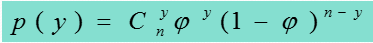
-  均数 = n * ψ 
-  方差 = $ψ*(1-ψ)$
-  均值，方差>5时接近正态

### 泊松分布

-  试验次数n很大，出现概率很小
-  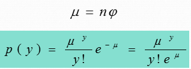
-  均数 = μ  ， 方差 = μ  ，μ > 20 接近正态

### 正态分布

$$
y～N  (μ ,σ^2）
$$

- 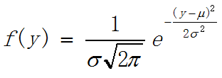
- 标准正态转化，查表

## 抽样分布

### 基本概念

1. 抽样分布：从一个总体按一定的样本容量随机地抽出所有可能的样本，由这些样本计算出的统计量必然形成的分布
2. XXX的抽样分布：随机样本的任何一种统计数都可以是一个变量，这种变量的分布称为统计数的抽样分布

### 样本均数抽样分布

1. 概念

   1. 标准误：样本导出量的标准差

   2. 中心极限定理：被抽样总体不是正态总体，但具有一定的平均数μ和方差σ^2^，则随样本容量n 的不断增大，样本平均数的分布越来越趋近于正态分布，且具有平均数μ和方差σ^2^/n,这称为中心极限定理
2. 标准差已知

   1. 正态总体：u分布
   2. 非正态总体：样本量大时，u分布

3. 标准差未知

   1. 正态总体：t分布
   2. 非正态总体：样本量大时，t分布
   3. 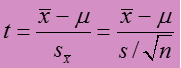,df = n-1

4. 两个总体样本均数和差分布

   1. 标准差已知的两个正态总体：u分布    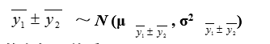     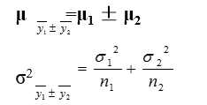

   2. 标准差未知的两个正态总体：。。。

### 样本方差的抽样分布

1. 单个正态样本：卡方分布 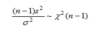
   1. s^2^为样本方差，σ^2^为总体方差
   2. 统计量>0，正偏，df=n-1，随着df增大趋于正态
   3. 可加性
2. 两个样本方差比的分布：F分布
   1.  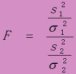
   2.  随着df1,df2增大趋于正态

## 参数估计

### 基本概念

1. 点估计：由样本统计量直接估计总体参数
2. 区间估计：在一定的可信度下，同时考虑抽样误差，给出一个范围
3. 估计量：用于估计总体参数的随机变量
4. 估计值：估计参数时计算出来的统计量的具体值
5. 评价估计量的标准
   1. 无偏性 (unbiasedness)：估计量抽样分布的数学期望等于被估计的总体参数
   2. 有效性：对同一总体参数的两个无偏点估计量，有更小标准差的估计量更有效
   3. 一致性：随着样本容量的增大，估计量的值越来越接近被估计的总体参数

### 区间估计

1. 置信度 (confidence level): 1-α

   > 总体均数在XX范围的可信度为XX
2. 总体均数

   1. 标准差已知： 双侧：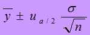，单侧~。查表~
   2. 标准差未知： 双侧：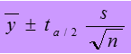，df=n-1
3. 总体（二项分布发生）概率

   1. 查表法：二项分布置信区间表。。
   2. 正态分布法：当n足够大，且n p 和n（1- p）均大于5时。计算过程？？
4. 其他似乎不是重点。。

##假设检验

### 基本原理

1. 假设检验/显著性检验：根据研究目的，对样本所属总体特征建立一个假设，然后根据样本资料所提供的信息进行计算及概率判断，对所建立的假设是否成立进行检验，作出接受或拒绝假设的结论

2. 依据：小概率事件原理

3. 两类错误：

   1. 第一类错误：假阳性错误：$α$

   2. 第二类错误：假阴性错误：$β$

   3. 检验的功效：$1-β$，置信度：$1-α
4. P值：在原假设成立的条件下，发生的该结果的概率

   > 所以p值太小了就拒绝原假设~
5. 计算步骤

   1. 建立$H_0$原/0假设和备选假设，二者互斥

   2. 计算统计量

   3. 确定检验水准

   4. 做出统计判读

      > p~差异具有统计学意义，拒绝$H_0$，接受$H_1$
      >
      > p~差异不具有显著意义，==不拒绝$H_0$==

### 单个样本的假设检验

1. 样本和总体比较
   > 检验该样本是不是来自XX参数的总体
   > ​
2. 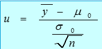 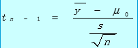,df=n-1

   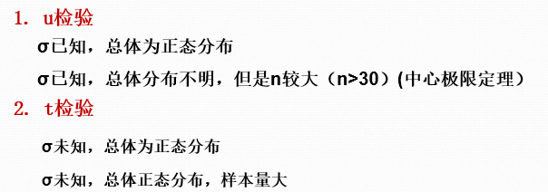

###两个样本的假设检验

1. 配对设计 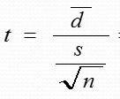

2. 完全随机设计均数检验

   1. 标准差已知——u检验 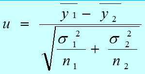

   2. 标准差未知但齐——联合估计 t检验

       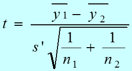 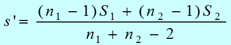

   3. 标准差未知且不等——加权 t检验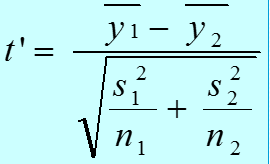 
      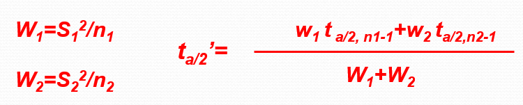

3. 方差齐次性检验 
   1. 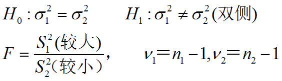
   2. 前提：两个样本均服从正态分布

4. 两个二项分布的发生概率检验——u检验

   1.  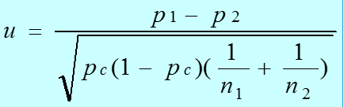 

   2.  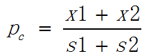
5. ~~泊松分布假设检验~~

   1. 前提：μ相等的？
      ### 区间估计与假设检验
      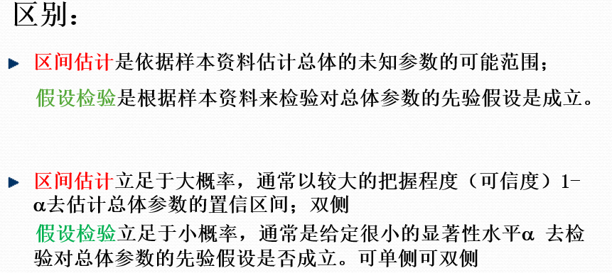
      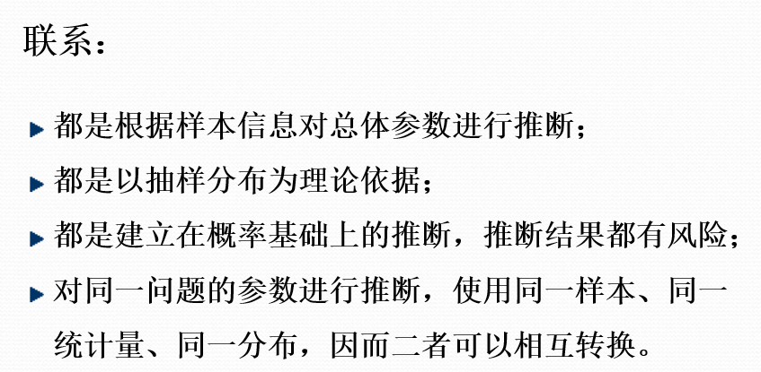

## 单因素方差分析

###基本原理

1. 应用多次的假设检验。会导致第一类错误概率增大，准确性降低。
2. ==方差分析==：将总变异分解为多个部分，再评价某个因素引起的变异是否具有统计学意义
3. 步骤
   1. 建立假设检验，检验水准$H_0,H_1,α$

      > $H_0$--某==总体参数==全相同
      >
      > $H_1$--不全相同
   2. 计算统计量，方差分析表

      1. $SS_总 = SS_{组内}+ SS_{组间}$ 

         > 组内==$SS_e$ 误差
         > ​
      2.   
      3. 
      4.    $\frac{MS_{组间}}{MS_e}$
         > F>...，知P<α，则拒绝H0，接受H1，差异具有统计学意义
         >
         > .....差异不具有显著意义，不拒绝$H_0$

### 多重比较
1. 则拒绝H0，接受H1，后继续分析。。具体是哪两个不等
2. LSD-t test
3. SNK q test
4. Bonferroni......会给公式吧。。如果要算的话。。。

### 前提

1. 检正态性

2. 检方差齐性———最大方差与最小方差之比大于2.5,考虑方差齐性检验

   1. Bartlett检验——正态
   2. Lavene检验——正态，非正态

3. 要是不齐，做==数值变化== 

   > 开根号，取对数，开根号反正弦

##双因素方差分析

###随机区组设计

1. 建立假设检验

   > 1. $H_0$：不同Treatment因素的作用下XXX==总体==均数相等；$H_1$：不同~因素的作用下XXX不全相等
   > 2. $H_0$：不同区组下XXX==总体==均数相等；$H_1$：不同区组下XXX不全相等
   >    两个假设。
2. 计算方差分析表
   >  
   >
   >  
   > ​
3. 构建统计量，结论
   >  
   >
   > F>xx，P<xxx，变异具有显著意义，拒绝$H_0$，则认为treatment对XX有影响
   >
   > F<xx ，P》xxx，变异不具有显著意义，不拒绝$H_0$，则认为区组因素对XXX没影响

### 析因分析
1. $SS_{treatment} = SS_a + SS_b + SS_{ab}$

## 拟合优度检验

###基本概念

1. 参数检验：已知总体分布类型，对未知参数进行统计推断
2. 非参数检验：不受总体分布类型影响，比较总体分布位置
   - 优点：方法简便，应用范围广，可用于参数检验难处理的资料
   - 缺点：方法粗糙，损失部分信息，检验效能低
   - 样本量较大时，两者结论常相同
3. 要求$n\ge50,{T_i}\ge5$否则增大样本容量或者合并区间

### 单个频数分布的~

1. 正态分布

   1. 建立假设检验

      > $H_0$：XXX实际频数与正态分布的理论频数符合
      >
      > $H_1$：不符合
   2. 计算$\chi^2$

      > 分组列出频数，计算理论频数（标准化）， 
      >
      > ，v = n - 1 - k(参数个数) ,
      >
      > 当理论频数<5时，需连续性矫正-0.5
   3. 结论

      > 查表得$\chi_{v,1-\alpha}^2$，与计算的$\chi^2$比较。
      >
      > 。。。
2. 二项分布

   1. 理论频数=理论频率*n。同样的计算卡方。

### 列联表的~

1. 完全随机设计
2. 配对设计
3. 交叉设计。。。。excuse,me.....

##一元回归

###基本概念

- 相关 (correlation) ：研究两个变量 X 和Y 彼此的关系，关联的程度

- 回归(regression)：研究变量 X 是如何影响变量 Y 的，用函数关系式表达变量间的依存关系（定量研究)
- 相关关系，函数关系，回归关系

### 简单相关

1. 总体相关系数$\rho$
2. 样本相关系数r 
3. 相关系数的假设检验
   1. t检验 ，df = n - 2 
   2. 查表。k独立自变量数，df=n-2

###简单回归

1. 做散点图，划线
2. 最小二乘法
   1. Q=....对a，b求导可得。
   2. b=xxxx，a=y-bx
3. 假设检验——回归方程是否具有统计学意义
   1. 对b做t检验
   2. 做方差分析

- 应用（公式gg）
  - $\hat{y}$的区间估计
  - 回归线的估计。。

### 理论前提

1. 线性
2. 独立
3. 正态
4. 方差齐

- ~~残差分析~~

## 多重回归

###基本原理

1. 求回归方程

   1. 最小二乘法。。分布对各个参数求导。
   2. 得正规方程。

2. 假设检验——回归方程是否具有统计学意义

   1. 方差分析

      > 和上面的一样。

3. 评价回归方程的指标

   1. 剩余标准差$\sqrt{MS_e}$
   2. 决定系数$R^2 = \frac{SS_回}{SS_总}$
   3. 校正决定系数$R^2 = \frac{MS_回}{MS_总}$
   4. 复相关系数$R = \sqrt{R^2}$
   5. 偏相关系数：扣除一个变量的影响后的相关系数
4. 自变量的选择（模型的选择）

   1. 选择的标准
      1. 使$SS_e$缩小
      2. 使$MS_e$缩小
      3. 使Cp越小

   2. 方法
      1. 全局选择法
      2. 逐步选择法
         1. 前进法
         2. 后退法
         3. 逐步回归法

- 前提：线性，独立，正态，方差齐

## 实验设计

### 基本要素

1. 处理因素
2. 受试对象
3. 实验效应

### 基本原则

1. 对照原则

   1. 安慰剂
   2. 盲法
   3. 空白
   4. 自身，相互，实验，标准，历史对照。

2. 随机化原则

   1. 分组，抽样，顺序。随机

3. 重复原则