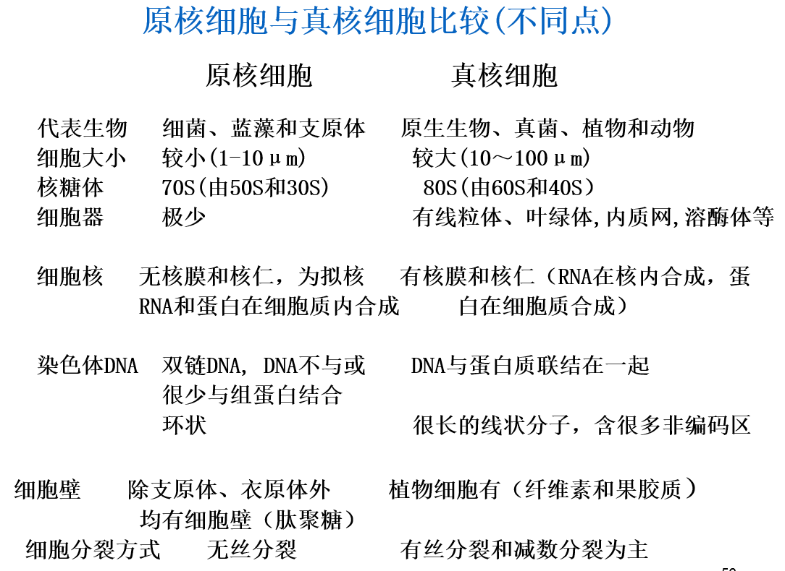

[TOC]

# 绪论

研究对象：研究细胞的结构、功能、以及各生命活动本质和规律的科学

胡克发现细胞

列文虎克发现活细胞

**细胞学说**——施莱登，施旺

​	内容：一切生物都由细胞组成，细胞是生物形态结构和功能活动的基本单位。

自然科学三大基石：进化论、能量守恒与转化、细胞学说

现代生物学三大基石：细胞学说，进化论，遗传学

之后的发展略略略

# 细胞统一性和多样性

病毒非细胞生命体

细胞是生命活动基本单位：

1. 构成有机体的基本单位
2. 代谢与功能的基本单位，  具有独立、有序的自控代谢体系
3. 是有机体生长与发育的基础
4. 遗传的基本单位，具有遗传的全能性
5. 没有细胞就没有完整的生命

## 原核细胞

Prokaryotic cell，代表支原体（最小，没有细胞壁）

1. 细菌Bacteria

   结构：拟核，核糖体，细胞壁，质粒，荚膜，鞭毛...

2. 蓝藻Cyanobacteria

   光合作用，单细胞生物，分布广

原核特征：

1. DNA复制、转录与翻译同时同地发生在拟核区
2. 只有1条双链裸露环状DNA
3. 唯一的细胞器是核糖体
4. 与呼吸有关的酶系存在于细胞膜
5. 细胞壁由肽聚糖与多肽组成

## 真核细胞

Eukaryotic cell，动植物细胞，真菌

 

## 病毒

virus由核酸和蛋白组成复合体

朊病毒：仅由蛋白质亚基构成，耐高压，各种抗性

类病毒：仅由RNA构成