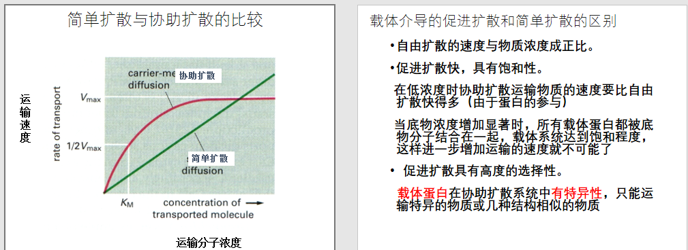
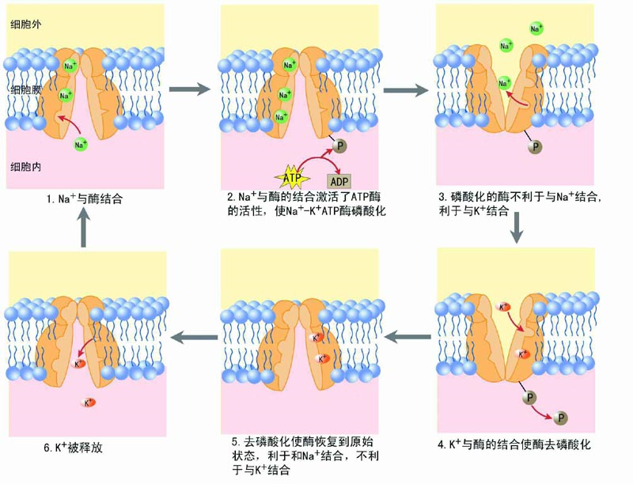
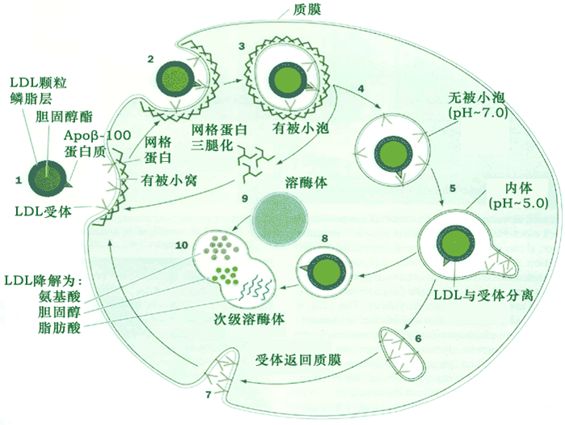

# 细胞质膜

围绕在细胞最外层极薄的膜——细胞(质)膜

围绕各种细胞器的膜——细胞内膜

生物膜——细胞质膜+内膜（细胞所有膜结构

利用成熟红细胞（血影）来研究，没有核与细胞器，低渗去掉血红蛋白和无机盐称血影

## 化学组成

1. 脂类(30－70％)——磷脂50%，胆固醇1/3，糖脂(少量

   双极性：自发形成双层，自我组装，自我封闭

2. 蛋白(20-70)

   外在(外周)膜蛋白：通过非共价键与其他膜蛋白连接

   脂锚定~：通过共价连接，位于膜外侧

   内在膜~：不同程度的嵌入磷脂双分子层内部（内部疏水，外侧亲水。跨膜区多为α螺旋

   去垢剂.一端亲水一端疏水，使膜蛋白在水中溶解、变性、沉淀 

   功能：运输，连接，受体（信号转导），酶

3. 糖类：糖脂，糖蛋白，共价结合膜质/膜蛋白，非胞质面（细胞外侧）?

   N-糖基化（门冬酰胺）；O-糖基化(丝氨酸或苏氨酸  （连接蛋白的方式？

## 细胞膜的特性 

液态镶嵌模型

1. 不对称性

   膜质成分，膜蛋白外表面多，糖类非胞质面多

2. 流动性

   膜脂，膜蛋白的分子运动

   影响膜脂因素：温度，胆固醇含量，脂肪酸链的长短、饱和度，卵磷脂和鞘磷脂的比例

   ​	胆固醇：在相变温度以下，它可以增加膜脂的流动性，在相变温度以上，它限制了膜脂的流动性

   ​	脂肪酸链的越长，流动性降低

   ​	卵磷脂：不饱和度高（双键弯曲）且链短，维持流动

   影响膜蛋白因素：蛋白的聚集，特异脂类，发生蛋白偶联，与细胞骨架作用

# 物质的跨膜运输

胞吞胞吐分子没有穿过膜，质膜选择透过性，疏水极性相似相溶

## 被动运输

1. 简单扩散——顺浓度梯度，不消耗能量，不需要蛋白协助

2. 协助扩散——顺浓度梯度，不消耗能量，需要膜转运蛋白

   载体蛋白（通过结合特定溶质，改变构象实现跨膜运输），通道蛋白（在层间形成亲水通道

   

## 主动运输

1. 离子泵

   特异性，具有运输功能ATP酶。 ATP驱动泵通过水解ATP获得能量

   P型泵：自磷酸化。α大亚基跨膜蛋白，β小亚基。V，F型略略略

   钠钾泵：水解1个ATP，摄入2个K+ ，排除3个Na+。维持**渗透平衡**

   

2. 偶联转运蛋白（协同运输（同\反），离子梯度动力）

   小肠葡萄糖G吸收：（逆浓度，不消耗ATP）

   1. G通过Na+驱动的同向协同运输进入上皮细胞。借助Na+的电化学势能
   2. 在通过协助扩散到血液中

3. 光驱动的泵利用光能运输物质，见于细菌

## 胞吞胞吐

大分子，又称膜泡运输

### 胞吞

​	胞饮作用，吞噬作用，

​	受体介导的内吞作用：LDL球形的脂蛋白颗粒，溶于血液
​	有被小窝：在细胞膜上进行胞饮作用的特定区域
​	有被小泡 (coated vesicle)：有被小窝在形成1分钟后内陷形成
​	网格蛋白：轻链重链二聚体的三联体，有被小泡和有被小窝的基本单位

LDL受体蛋白基因突变-->LDL颗粒不能进入细胞，不能在细胞内释放游离的胆固醇分子-->冠状动脉粥样硬化症

​	非特异性的内吞作用：胞膜窑介导，窑蛋白。略略略

### 胞吐

结构分泌途径：连续分泌蛋白，提供质膜，存在所有细胞中（主动？

调节分泌途径：反面高尔基体分泌囊泡储存，直到受到信号刺激分泌（被动？