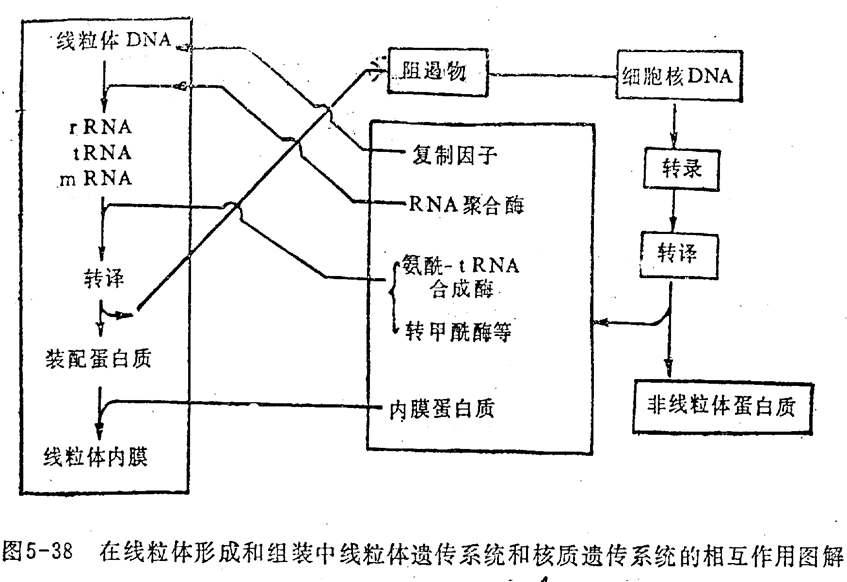

# 线粒体

mitochondrion，放出能量40%存在ATP中

形状，数量有多有少，分布细胞功能旺盛区域～

## 超微结构

外膜通透性强，内膜弱，（氧化磷酸化的场所）。内膜向内延伸形成嵴

特征酶：

外膜:单胺氧化酶
膜间隙:腺苷酸激酶
内膜:细胞色素 (C) 氧化酶
基质:苹果酸脱氢酶

## 功能

氧化磷酸化合成ATP，过程略（不考

### ATP 合酶及结合变构机制

质子推动F0的旋转，带动$\lambda$亚基的旋转，$\beta$亚基构象改变，催化合成

三种（构象）催化位点：L位点：ADP+Pi；T位点：结合形成ATP；O位点：释放ATP；

衰老凋亡～

## 半自主性

一个或多个mtDNA（裸露环状闭合，少量），复制周期不同，母系遗传，突变率高，不能修复、替代

线粒体合成蛋白，转录和翻译在同一地点，与内膜结合

 

线粒体蛋白转运（不考

## 其他

### 克山病

缺硒影响线粒体膜稳定性，导致心肌线粒体膨胀、嵴稀少和不完整

临床表现主要有心脏增大，心律失常

### 同源共生

原始线粒体被原始真核生物吞噬后与宿主间形成共生关系。

原线粒体可从宿主处获得更多的营养,而宿主可借用原线粒体具有的氧化分解功能获得更多的能量。