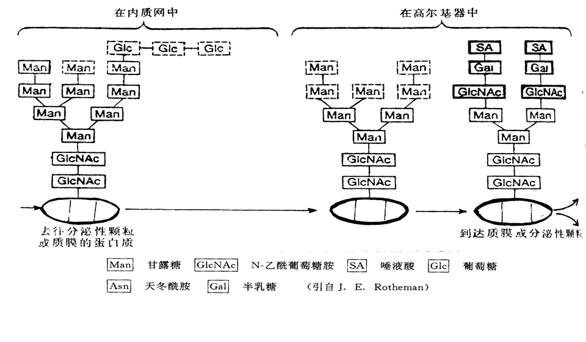

# 内膜系统

内膜系统是真核细胞的细胞质内，在结构、功能和发生上有一定联系的膜性结构的总称

## 内质网 ER

RER在分泌蛋白合成旺盛的细胞中多，SER在合成类固醇激素的细胞中多

与细胞核外模连接，与微管平行，与线粒体靠近

组成：蛋白，脂类，RNA。

### 糙面内质网 RER

核糖体附着

指导蛋白质转至内质网上合成，信号肽假说：

	1. 核糖体上合成信号肽，SRP与之结合形成复合体
	2. 复合体结合到内质网上SRP受体，SRP分离（SRP循坏
	3. 肽链和信号肽进入内质网腔
	4. 信号肽切除，肽链继续合成，完成（核糖体循坏

跨膜蛋白：多个信号序列，起始转移序列和停止转移序列

蛋白修饰加工（糖基化）：N-连接糖基化，将寡糖连接到天冬氨酸残基上，N-乙酰葡萄糖氨起始

糖基化作用：折叠成正确构象；保护蛋白不被水解；运输信号；细胞识别保护质膜

驻留蛋白：蛋白二硫异构酶，分子伴侣。功能：识别不正确折叠的蛋白，识别未组装的，协助折叠，防止聚集

驻留信号：KDEL，使驻留蛋白留在内质网中，回收错误运送的蛋白

机制？？

运输：转运小泡，出芽，融合

### 光面内质网 SER

1. 合成脂类

   过程.....转运：翻转，出芽，磷脂交换蛋白PEP

2. 解毒——肝细胞。氧化+O，羟基化+H

3. 糖原分解

   糖原在细胞质中降解成->葡萄糖-6-磷酸。葡萄糖-6-磷酸酶将其去磷酸化，胞吐到血液中。更易被吸收。

## 高尔基体

分泌功能旺盛的细胞中多，淋巴、肌肉细胞少

结构：顺面高尔基网，顺面潴泡，中间潴泡，反面潴泡，反面高尔基网

极性：位置，结构，功能

特征酶：糖基转移酶

功能：

1. 蛋白糖基化，溶酶体酶的磷酸化，蛋白聚糖的合成
2. ​

O-连接糖基化。蛋白，脂类糖基化。

溶酶体酶的合成，膜流，膜泡运输

## 溶酶体

各种名词：

功能：

矽肺病

|       | 溶酶体                | 过氧化物酶体              |
| ----- | :----------------- | ------------------- |
| 形态大小  | 球形，无酶晶体            | 球形，含有酶晶体            |
| 酶种类   | 酸性水解酶              | 含有氧化酶类              |
| PH    | 5左右                | 7左右                 |
| 是否需氧气 | 不需                 | 需要                  |
| 功能    | 细胞内的消化作用           | 多种功能                |
| 形成    | 酶在rER合成，经Golgi出芽形成 | 酶在细胞质基质中合成，经分裂与装配形成 |
| 标志酶   | 酸性磷酸酶              | 过氧化氢酶               |
